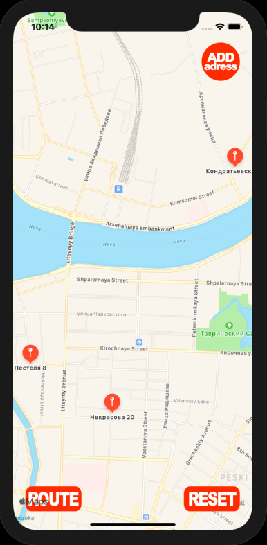

# iOS Jun test task - Route

Приложение для построения кратчайшего маршрута через заданные географические точки.

Приложение представляет собой карту с возможностью добавления точек.
Точки формируются после ввода адреса. Если у сервера не получилось определить координаты по адресу, появляется сообщение, информирующее о необходимости повторить операцию.

 

После добавления трех точек, появляются кнопки с возможностью проложить маршрут или очистить карту. Маршрут строится в порядке добавления адресов.

 

